EDA v2
=======

Imports
~~~~~~~

.. code:: ipython3

    import pandas as pd
    import re
    import string
    import plotly.express as px
    import plotly.figure_factory as ff
    import nltk
    from nltk.tokenize import sent_tokenize
    from nltk.corpus import stopwords
    from nltk.probability import FreqDist
    from sklearn.feature_extraction.text import CountVectorizer
    import numpy as np
    
    from src.data.nordskog_data import get_data
    from src.data.preprocessing import DataPreprocessorNordskog, DataPreprocessorHelland
    
    from src.annotation.doccano import get_latest_annotated_data

Loading data
~~~~~~~~~~~~

.. code:: ipython3

    train, test = get_data()
    
    data = get_latest_annotated_data().drop('Unnamed: 2', axis=1) 

About the data
~~~~~~~~~~~~~~

The data used for my master thesis is based on two datasets. The first
and orignal dataset was collected by Aanund Nordskog and was the
inspiration for the thesis and the further collection of my own
supplementary dataset. The new dataset is meant to tackle and solve
apperent problems with the first dataset, and give the task of
classifying paragraphs from football articles a new and more complete
approach.

The original data is a collection of fotball articles collected by
Aanund Nordskog from VG and TV2, divided into paragraphs. The training
data was retrieved form articles published between 22.07.18 and
17.09.18. The testing data is from articles between 14.12.19. Not that
the the different time periods may affect the kind of articles published
in the different periods. Each paragraph is labeled as following:

.. raw:: html

   <ul>

.. raw:: html

   <li>

Goal/Assist

.. raw:: html

   </li>

.. raw:: html

   <li>

Quotes

.. raw:: html

   </li>

.. raw:: html

   <li>

Transfer

.. raw:: html

   </li>

.. raw:: html

   <li>

Irrelevant

.. raw:: html

   </li>

.. raw:: html

   <li>

Ignore

.. raw:: html

   </li>

.. raw:: html

   <li>

Player Detail

.. raw:: html

   </li>

.. raw:: html

   <li>

Club Detail

.. raw:: html

   </li>

.. raw:: html

   <li>

Chances

.. raw:: html

   </li>

.. raw:: html

   </ul>

The new data, collected by Eirik Helland, is paragraphs from football
articles at VG.no in the preiod between 01.01.2022 and 01.01.2023. The
total data collected is 10147 paragraphs, and of these paragraphs, 2000
have been annotated. The paragraphs have been annotated in a random
order to prevent the seasonal football events to be to prevelant in the
data. This is important becuase some events only occur in the start or
end of a season or every other season, such as transfer windows and
international cups. The data have been annotated with multiple labels,
making the task multi-label classification instead of multi-class
classification as in the case of Nordskog’s dataset. The possible labels
are as follows:

.. raw:: html

   <ul>

.. raw:: html

   <li>

Booking

.. raw:: html

   </li>

.. raw:: html

   <li>

Chance

.. raw:: html

   </li>

.. raw:: html

   <li>

Commentary

.. raw:: html

   </li>

.. raw:: html

   <li>

Description

.. raw:: html

   </li>

.. raw:: html

   <li>

Garbage

.. raw:: html

   </li>

.. raw:: html

   <li>

Goal

.. raw:: html

   </li>

.. raw:: html

   <li>

Injury

.. raw:: html

   </li>

.. raw:: html

   <li>

Link

.. raw:: html

   </li>

.. raw:: html

   <li>

Next game

.. raw:: html

   </li>

.. raw:: html

   <li>

Odds

.. raw:: html

   </li>

.. raw:: html

   <li>

Opinion

.. raw:: html

   </li>

.. raw:: html

   <li>

Quote

.. raw:: html

   </li>

.. raw:: html

   <li>

Rumour

.. raw:: html

   </li>

.. raw:: html

   <li>

Set-piece

.. raw:: html

   </li>

.. raw:: html

   <li>

Statement

.. raw:: html

   </li>

.. raw:: html

   <li>

Statistics

.. raw:: html

   </li>

.. raw:: html

   <li>

Storytelling

.. raw:: html

   </li>

.. raw:: html

   <li>

Substitution

.. raw:: html

   </li>

.. raw:: html

   <li>

Summary

.. raw:: html

   </li>

.. raw:: html

   <li>

Table

.. raw:: html

   </li>

.. raw:: html

   <li>

Transfer

.. raw:: html

   </li>

.. raw:: html

   <li>

VAR

.. raw:: html

   </li>

.. raw:: html

   </ul>

There are a total off 22 different labels. The labels are split into
different levels of type of information. The different levels are
Paragraph type, Communication type, Paragraph content and Paragraph
action. None of the labels are mutually exclusive because of the
paragraphs sometimes containing multiple levels of information. Patterns
will occur as the style by the writers at VG.no probably is guided by
shared guidelines.

.. code:: ipython3

    # Printing the dimension of the data
    print("Nordskogs's data:")
    print(f'Number of training paragraphs:{train.shape}')
    print(f'Number of testing paragraphs: {test.shape}\n')
    print('Multi-label data:')
    print(f'Number of testing paragraphs: {data.shape}')

.. parsed-literal::

    Nordskogs's data:
    Number of training paragraphs:(5526, 2)
    Number of testing paragraphs: (611, 2)
    
    Multi-label data:
    Number of testing paragraphs: (2005, 2)
    

.. code:: ipython3

    # Displaying the first rows of training data
    train.head()

.. raw:: html

    

    
    <table border="1" class="dataframe">
      <thead>
        <tr style="text-align: right;">
          <th></th>
          <th>text</th>
          <th>label</th>
        </tr>
      </thead>
      <tbody>
        <tr>
          <th>0</th>
          <td>Vålerenga - Rosenborg 2-3</td>
          <td>Ignore</td>
        </tr>
        <tr>
          <th>1</th>
          <td>Sam Johnson ga vertene ledelsen, men Jonathan ...</td>
          <td>Goal/Assist</td>
        </tr>
        <tr>
          <th>2</th>
          <td>På et hjørnespark langt på overtid kom avgjøre...</td>
          <td>Goal/Assist</td>
        </tr>
        <tr>
          <th>3</th>
          <td>Ti minutter før pause scoret Sam Johnson sitt ...</td>
          <td>Goal/Assist</td>
        </tr>
        <tr>
          <th>4</th>
          <td>Vålerenga holdt 1-0-ledelsen bare frem til sis...</td>
          <td>Goal/Assist</td>
        </tr>
      </tbody>
    </table>
    

.. code:: ipython3

    test.head()

.. raw:: html

    

    
    <table border="1" class="dataframe">
      <thead>
        <tr style="text-align: right;">
          <th></th>
          <th>text</th>
          <th>label</th>
        </tr>
      </thead>
      <tbody>
        <tr>
          <th>0</th>
          <td>Se Manchester City-Chelsea søndag fra 16.30 (k...</td>
          <td>Ignore</td>
        </tr>
        <tr>
          <th>1</th>
          <td>Chelsea har en lang tradisjon for å hente stje...</td>
          <td>Irrelevant</td>
        </tr>
        <tr>
          <th>2</th>
          <td>Spillere som Andrij Sjevtsjenko, Fernando Torr...</td>
          <td>Irrelevant</td>
        </tr>
        <tr>
          <th>3</th>
          <td>Blant alle skuffelsene har det likevel vært ly...</td>
          <td>Irrelevant</td>
        </tr>
        <tr>
          <th>4</th>
          <td>Det er denne rekken Higuaín nå håper å føye se...</td>
          <td>Irrelevant</td>
        </tr>
      </tbody>
    </table>
    

.. code:: ipython3

    data.head()

.. raw:: html

    

    
    <table border="1" class="dataframe">
      <thead>
        <tr style="text-align: right;">
          <th></th>
          <th>text</th>
          <th>label</th>
        </tr>
      </thead>
      <tbody>
        <tr>
          <th>0</th>
          <td>Premier League valgte å offentliggjøre tre fly...</td>
          <td>[Link]</td>
        </tr>
        <tr>
          <th>1</th>
          <td>Romelu Lukaku har uttalt at han er misfornøyd ...</td>
          <td>[Opinion, Statement]</td>
        </tr>
        <tr>
          <th>2</th>
          <td>– La oss være ærlige. Jeg liker det ikke, for ...</td>
          <td>[Quote]</td>
        </tr>
        <tr>
          <th>3</th>
          <td>Manchester United har fått mye kritikk etter å...</td>
          <td>[Commentary]</td>
        </tr>
        <tr>
          <th>4</th>
          <td>Her er torsdagens oddstips!</td>
          <td>[Garbage, Link, Odds]</td>
        </tr>
      </tbody>
    </table>
    

.. code:: ipython3

    # Displaying info
    print('Training data:')
    print(train.info())
    print('\nTesting data:')
    print(test.info())
    print('\nMulti-label data:')
    print(data.info())

.. parsed-literal::

    Training data:
    <class 'pandas.core.frame.DataFrame'>
    RangeIndex: 5526 entries, 0 to 5525
    Data columns (total 2 columns):
     #   Column  Non-Null Count  Dtype 
    ---  ------  --------------  ----- 
     0   text    5526 non-null   object
     1   label   5526 non-null   object
    dtypes: object(2)
    memory usage: 86.5+ KB
    None
    
    Testing data:
    <class 'pandas.core.frame.DataFrame'>
    RangeIndex: 611 entries, 0 to 610
    Data columns (total 2 columns):
     #   Column  Non-Null Count  Dtype 
    ---  ------  --------------  ----- 
     0   text    611 non-null    object
     1   label   611 non-null    object
    dtypes: object(2)
    memory usage: 9.7+ KB
    None
    
    Multi-label data:
    <class 'pandas.core.frame.DataFrame'>
    RangeIndex: 2005 entries, 0 to 2004
    Data columns (total 2 columns):
     #   Column  Non-Null Count  Dtype 
    ---  ------  --------------  ----- 
     0   text    2005 non-null   object
     1   label   2002 non-null   object
    dtypes: object(2)
    memory usage: 31.5+ KB
    None
    

.. code:: ipython3

    # Display statistical information for categorical variables
    train.describe(include=object)

.. raw:: html

    

    
    <table border="1" class="dataframe">
      <thead>
        <tr style="text-align: right;">
          <th></th>
          <th>text</th>
          <th>label</th>
        </tr>
      </thead>
      <tbody>
        <tr>
          <th>count</th>
          <td>5526</td>
          <td>5526</td>
        </tr>
        <tr>
          <th>unique</th>
          <td>5436</td>
          <td>12</td>
        </tr>
        <tr>
          <th>top</th>
          <td>Tipster gir deg ferske oddstips hver dag!</td>
          <td>Goal/Assist</td>
        </tr>
        <tr>
          <th>freq</th>
          <td>11</td>
          <td>1117</td>
        </tr>
      </tbody>
    </table>
    

There are 90 paragraphs that are not unique, with “Tipster gir deg…”
being the most frequent.

.. code:: ipython3

    train[train['text'].duplicated()]

.. raw:: html

    

    
    <table border="1" class="dataframe">
      <thead>
        <tr style="text-align: right;">
          <th></th>
          <th>text</th>
          <th>label</th>
        </tr>
      </thead>
      <tbody>
        <tr>
          <th>83</th>
          <td>Se målene i Sportsnyhetene øverst!\n</td>
          <td>Ignore</td>
        </tr>
        <tr>
          <th>378</th>
          <td>Se målene i Sportsnyhetene øverst!\n</td>
          <td>Ignore</td>
        </tr>
        <tr>
          <th>840</th>
          <td>Tipster gir deg ferske oddstips hver dag!</td>
          <td>Ignore</td>
        </tr>
        <tr>
          <th>846</th>
          <td>Tipster gir deg ferske oddstips hver dag!</td>
          <td>Ignore</td>
        </tr>
        <tr>
          <th>847</th>
          <td>• Her er fredagens oddstips</td>
          <td>Ignore</td>
        </tr>
        <tr>
          <th>...</th>
          <td>...</td>
          <td>...</td>
        </tr>
        <tr>
          <th>5376</th>
          <td>Se generaltabben i videovinduet øverst.</td>
          <td>Ignore</td>
        </tr>
        <tr>
          <th>5383</th>
          <td>Se Leicester mot Liverpool på TV 2 Sport Premi...</td>
          <td>Ignore</td>
        </tr>
        <tr>
          <th>5387</th>
          <td>Se Europaligaen på TV 2 Sumo og TV 2s kanaler!\n</td>
          <td>Ignore</td>
        </tr>
        <tr>
          <th>5398</th>
          <td>VG Live: Følg Norge-Nederland kl. 17.00</td>
          <td>Ignore</td>
        </tr>
        <tr>
          <th>5400</th>
          <td>Norge-Kypros ser du på TV 2 eller følger på V...</td>
          <td>Ignore</td>
        </tr>
      </tbody>
    </table>
    
90 rows × 2 columns

    

.. code:: ipython3

    # Display statistical information for categorical variables
    test.describe(include=object)

.. raw:: html

    

    
    <table border="1" class="dataframe">
      <thead>
        <tr style="text-align: right;">
          <th></th>
          <th>text</th>
          <th>label</th>
        </tr>
      </thead>
      <tbody>
        <tr>
          <th>count</th>
          <td>611</td>
          <td>611</td>
        </tr>
        <tr>
          <th>unique</th>
          <td>609</td>
          <td>5</td>
        </tr>
        <tr>
          <th>top</th>
          <td>– Selvfølgelig vil jeg tilbake til Madrid og s...</td>
          <td>Irrelevant</td>
        </tr>
        <tr>
          <th>freq</th>
          <td>2</td>
          <td>293</td>
        </tr>
      </tbody>
    </table>
    

There are at least two duplicate paragraphs in the testing data

.. code:: ipython3

    test[test['text'].duplicated()]

.. raw:: html

    

    
    <table border="1" class="dataframe">
      <thead>
        <tr style="text-align: right;">
          <th></th>
          <th>text</th>
          <th>label</th>
        </tr>
      </thead>
      <tbody>
        <tr>
          <th>290</th>
          <td>– Selvfølgelig vil jeg tilbake til Madrid og s...</td>
          <td>Quote</td>
        </tr>
        <tr>
          <th>588</th>
          <td>– Jeg har mange drømmer, også her i Vitesse. Å...</td>
          <td>Quote</td>
        </tr>
      </tbody>
    </table>
    

.. code:: ipython3

    # Display statistical information for categorical variables
    data.describe(include=object)

.. raw:: html

    

    
    <table border="1" class="dataframe">
      <thead>
        <tr style="text-align: right;">
          <th></th>
          <th>text</th>
          <th>label</th>
        </tr>
      </thead>
      <tbody>
        <tr>
          <th>count</th>
          <td>2005</td>
          <td>2002</td>
        </tr>
        <tr>
          <th>unique</th>
          <td>2003</td>
          <td>226</td>
        </tr>
        <tr>
          <th>top</th>
          <td>– Vi vil ikke la dem forby våre ytringer. Når ...</td>
          <td>[Storytelling]</td>
        </tr>
        <tr>
          <th>freq</th>
          <td>2</td>
          <td>429</td>
        </tr>
      </tbody>
    </table>
    

.. code:: ipython3

    data[data['text'].duplicated()]

.. raw:: html

    

    
    <table border="1" class="dataframe">
      <thead>
        <tr style="text-align: right;">
          <th></th>
          <th>text</th>
          <th>label</th>
        </tr>
      </thead>
      <tbody>
        <tr>
          <th>1434</th>
          <td>– Vi vil ikke la dem forby våre ytringer. Når ...</td>
          <td>[Quote, Statement]</td>
        </tr>
        <tr>
          <th>1856</th>
          <td>Hugo Lloris 8</td>
          <td>[Garbage]</td>
        </tr>
      </tbody>
    </table>
    

.. code:: ipython3

    train['label'].value_counts()

.. parsed-literal::

    Goal/Assist       1117
    quote              975
    Transfer           887
    irrelevant         812
    Ignore             663
    Player details     340
    Club details       315
    sjanse             300
    Injuries            59
    Rodt/gult kort      50
    Club drama           5
    Personal drama       3
    Name: label, dtype: int64

.. code:: ipython3

    test['label'].value_counts()

.. parsed-literal::

    Irrelevant     293
    Quote          141
    Goal/Assist     69
    Transfer        60
    Ignore          48
    Name: label, dtype: int64

.. code:: ipython3

    data['label'].value_counts()

.. parsed-literal::

    [Storytelling]                       429
    [Quote]                              178
    [Garbage]                            153
    [Quote, Statement]                   151
    [Statement, Storytelling]             69
                                        ... 
    [Injury]                               1
    [Commentary, Rumour, Transfer]         1
    [Commentary, Quote, Storytelling]      1
    [Goal, Storytelling, Table]            1
    [Opinion, Quote, Transfer]             1
    Name: label, Length: 226, dtype: int64

.. code:: ipython3

    exploded_data = data.explode('label').reset_index(drop=True)
    label_freq = exploded_data.groupby(['label'], as_index=False).agg(frequency=('label', 'count'))
    label_freq

.. raw:: html

    

    
    <table border="1" class="dataframe">
      <thead>
        <tr style="text-align: right;">
          <th></th>
          <th>label</th>
          <th>frequency</th>
        </tr>
      </thead>
      <tbody>
        <tr>
          <th>0</th>
          <td>Booking</td>
          <td>16</td>
        </tr>
        <tr>
          <th>1</th>
          <td>Chance</td>
          <td>42</td>
        </tr>
        <tr>
          <th>2</th>
          <td>Commentary</td>
          <td>106</td>
        </tr>
        <tr>
          <th>3</th>
          <td>Description</td>
          <td>207</td>
        </tr>
        <tr>
          <th>4</th>
          <td>Garbage</td>
          <td>223</td>
        </tr>
        <tr>
          <th>5</th>
          <td>Goal</td>
          <td>169</td>
        </tr>
        <tr>
          <th>6</th>
          <td>Injury</td>
          <td>45</td>
        </tr>
        <tr>
          <th>7</th>
          <td>Link</td>
          <td>30</td>
        </tr>
        <tr>
          <th>8</th>
          <td>Next game</td>
          <td>57</td>
        </tr>
        <tr>
          <th>9</th>
          <td>Odds</td>
          <td>20</td>
        </tr>
        <tr>
          <th>10</th>
          <td>Opinion</td>
          <td>82</td>
        </tr>
        <tr>
          <th>11</th>
          <td>Quote</td>
          <td>448</td>
        </tr>
        <tr>
          <th>12</th>
          <td>Rumour</td>
          <td>32</td>
        </tr>
        <tr>
          <th>13</th>
          <td>Set-piece</td>
          <td>57</td>
        </tr>
        <tr>
          <th>14</th>
          <td>Statement</td>
          <td>389</td>
        </tr>
        <tr>
          <th>15</th>
          <td>Statistics</td>
          <td>60</td>
        </tr>
        <tr>
          <th>16</th>
          <td>Storytelling</td>
          <td>874</td>
        </tr>
        <tr>
          <th>17</th>
          <td>Substitution</td>
          <td>24</td>
        </tr>
        <tr>
          <th>18</th>
          <td>Summary</td>
          <td>226</td>
        </tr>
        <tr>
          <th>19</th>
          <td>Table</td>
          <td>68</td>
        </tr>
        <tr>
          <th>20</th>
          <td>Transfer</td>
          <td>57</td>
        </tr>
        <tr>
          <th>21</th>
          <td>VAR</td>
          <td>12</td>
        </tr>
      </tbody>
    </table>
    

Data preprocessing
~~~~~~~~~~~~~~~~~~

.. code:: ipython3

    processed_train = DataPreprocessorNordskog(train)
    processed_train.map_nordskog_data()
    train = processed_train.data.copy()
    
    preprocessed_data = data.copy()
    data_processor = DataPreprocessorHelland(preprocessed_data['text'])
    preprocessed_data['text'] = data_processor.preprocess().copy()
    preprocessed_data

.. raw:: html

    

    
    <table border="1" class="dataframe">
      <thead>
        <tr style="text-align: right;">
          <th></th>
          <th>text</th>
          <th>label</th>
        </tr>
      </thead>
      <tbody>
        <tr>
          <th>0</th>
          <td>premier league valgte offentliggjøre tre flytt...</td>
          <td>[Link]</td>
        </tr>
        <tr>
          <th>1</th>
          <td>romelu lukaku uttalt misfornøyd egen situasjon...</td>
          <td>[Opinion, Statement]</td>
        </tr>
        <tr>
          <th>2</th>
          <td>– la ærlige liker skaper støy trenger</td>
          <td>[Quote]</td>
        </tr>
        <tr>
          <th>3</th>
          <td>manchester united fått mye kritikk karet – tab...</td>
          <td>[Commentary]</td>
        </tr>
        <tr>
          <th>4</th>
          <td>torsdagens oddstips</td>
          <td>[Garbage, Link, Odds]</td>
        </tr>
        <tr>
          <th>...</th>
          <td>...</td>
          <td>...</td>
        </tr>
        <tr>
          <th>2000</th>
          <td>marko gruljic red star belgrade januar</td>
          <td>[Garbage]</td>
        </tr>
        <tr>
          <th>2001</th>
          <td>tv s fotballkommentator øyvind alsaker mener k...</td>
          <td>[Opinion, Storytelling]</td>
        </tr>
        <tr>
          <th>2002</th>
          <td>fire beste premier league får spille champions...</td>
          <td>[Storytelling, Table]</td>
        </tr>
        <tr>
          <th>2003</th>
          <td>– virgil van dijk alisson becker mohamed salah...</td>
          <td>[Opinion, Quote, Transfer]</td>
        </tr>
        <tr>
          <th>2004</th>
          <td>januar åpner overgangsvinduet storklubbene eur...</td>
          <td>[Storytelling]</td>
        </tr>
      </tbody>
    </table>
    
2005 rows × 2 columns

    

.. code:: ipython3

    train['num_char'] = train['text'].map(lambda x: len(x))
    train['num_words'] = train['text'].map(lambda x: len(x.split()))
    train['num_sent'] = train['text'].map(lambda x: len(sent_tokenize(x)))
    train['avg_word_len'] = train['text'].map(lambda x: np.mean([len(word) for word in str(x).split()]))
    train['avg_sent_len'] = train['text'].map(lambda x: np.mean([len(word.split()) for word in sent_tokenize(x)]))
    train

.. raw:: html

    

    
    <table border="1" class="dataframe">
      <thead>
        <tr style="text-align: right;">
          <th></th>
          <th>text</th>
          <th>label</th>
          <th>num_char</th>
          <th>num_words</th>
          <th>num_sent</th>
          <th>avg_word_len</th>
          <th>avg_sent_len</th>
        </tr>
      </thead>
      <tbody>
        <tr>
          <th>0</th>
          <td>Vålerenga - Rosenborg 2-3</td>
          <td>Ignore</td>
          <td>25</td>
          <td>4</td>
          <td>1</td>
          <td>5.500000</td>
          <td>4.0</td>
        </tr>
        <tr>
          <th>1</th>
          <td>Sam Johnson ga vertene ledelsen, men Jonathan ...</td>
          <td>Goal/Assist</td>
          <td>187</td>
          <td>31</td>
          <td>2</td>
          <td>5.064516</td>
          <td>15.5</td>
        </tr>
        <tr>
          <th>2</th>
          <td>På et hjørnespark langt på overtid kom avgjøre...</td>
          <td>Goal/Assist</td>
          <td>134</td>
          <td>20</td>
          <td>1</td>
          <td>5.750000</td>
          <td>20.0</td>
        </tr>
        <tr>
          <th>3</th>
          <td>Ti minutter før pause scoret Sam Johnson sitt ...</td>
          <td>Goal/Assist</td>
          <td>166</td>
          <td>31</td>
          <td>1</td>
          <td>4.387097</td>
          <td>31.0</td>
        </tr>
        <tr>
          <th>4</th>
          <td>Vålerenga holdt 1-0-ledelsen bare frem til sis...</td>
          <td>Goal/Assist</td>
          <td>203</td>
          <td>29</td>
          <td>2</td>
          <td>6.034483</td>
          <td>14.5</td>
        </tr>
        <tr>
          <th>...</th>
          <td>...</td>
          <td>...</td>
          <td>...</td>
          <td>...</td>
          <td>...</td>
          <td>...</td>
          <td>...</td>
        </tr>
        <tr>
          <th>5521</th>
          <td>– Mateo har sagt at han ønsker å dra. Jeg vil ...</td>
          <td>Quote</td>
          <td>152</td>
          <td>29</td>
          <td>2</td>
          <td>4.275862</td>
          <td>14.5</td>
        </tr>
        <tr>
          <th>5522</th>
          <td>– Her gjør han en miss. Han står midt i mål, o...</td>
          <td>Quote</td>
          <td>242</td>
          <td>46</td>
          <td>4</td>
          <td>4.282609</td>
          <td>11.5</td>
        </tr>
        <tr>
          <th>5523</th>
          <td>– Vi kan ta med masse positivt fra kampen, for...</td>
          <td>Quote</td>
          <td>213</td>
          <td>42</td>
          <td>2</td>
          <td>4.095238</td>
          <td>21.0</td>
        </tr>
        <tr>
          <th>5524</th>
          <td>Den tyske midtbanespilleren kom til Bayern Mün...</td>
          <td>Player Detail</td>
          <td>327</td>
          <td>53</td>
          <td>2</td>
          <td>4.735849</td>
          <td>26.5</td>
        </tr>
        <tr>
          <th>5525</th>
          <td>Bendtner har vært i norsk fotball siden mars 2...</td>
          <td>Player Detail</td>
          <td>170</td>
          <td>29</td>
          <td>2</td>
          <td>4.896552</td>
          <td>14.5</td>
        </tr>
      </tbody>
    </table>
    
5526 rows × 7 columns

    

.. code:: ipython3

    data['num_char'] = train['text'].map(lambda x: len(x))
    data['num_words'] = train['text'].map(lambda x: len(x.split()))
    data['num_sent'] = train['text'].map(lambda x: len(sent_tokenize(x)))
    data['avg_word_len'] = train['text'].map(lambda x: np.mean([len(word) for word in str(x).split()]))
    data['avg_sent_len'] = train['text'].map(lambda x: np.mean([len(word.split()) for word in sent_tokenize(x)]))
    data

.. raw:: html

    

    
    <table border="1" class="dataframe">
      <thead>
        <tr style="text-align: right;">
          <th></th>
          <th>text</th>
          <th>label</th>
          <th>num_char</th>
          <th>num_words</th>
          <th>num_sent</th>
          <th>avg_word_len</th>
          <th>avg_sent_len</th>
        </tr>
      </thead>
      <tbody>
        <tr>
          <th>0</th>
          <td>Premier League valgte å offentliggjøre tre fly...</td>
          <td>[Link]</td>
          <td>25</td>
          <td>4</td>
          <td>1</td>
          <td>5.500000</td>
          <td>4.0</td>
        </tr>
        <tr>
          <th>1</th>
          <td>Romelu Lukaku har uttalt at han er misfornøyd ...</td>
          <td>[Opinion, Statement]</td>
          <td>187</td>
          <td>31</td>
          <td>2</td>
          <td>5.064516</td>
          <td>15.5</td>
        </tr>
        <tr>
          <th>2</th>
          <td>– La oss være ærlige. Jeg liker det ikke, for ...</td>
          <td>[Quote]</td>
          <td>134</td>
          <td>20</td>
          <td>1</td>
          <td>5.750000</td>
          <td>20.0</td>
        </tr>
        <tr>
          <th>3</th>
          <td>Manchester United har fått mye kritikk etter å...</td>
          <td>[Commentary]</td>
          <td>166</td>
          <td>31</td>
          <td>1</td>
          <td>4.387097</td>
          <td>31.0</td>
        </tr>
        <tr>
          <th>4</th>
          <td>Her er torsdagens oddstips!</td>
          <td>[Garbage, Link, Odds]</td>
          <td>203</td>
          <td>29</td>
          <td>2</td>
          <td>6.034483</td>
          <td>14.5</td>
        </tr>
        <tr>
          <th>...</th>
          <td>...</td>
          <td>...</td>
          <td>...</td>
          <td>...</td>
          <td>...</td>
          <td>...</td>
          <td>...</td>
        </tr>
        <tr>
          <th>2000</th>
          <td>Marko Gruljic fra Red Star Belgrade 6. januar ...</td>
          <td>[Garbage]</td>
          <td>61</td>
          <td>9</td>
          <td>1</td>
          <td>5.888889</td>
          <td>9.0</td>
        </tr>
        <tr>
          <th>2001</th>
          <td>TV 2s fotballkommentator Øyvind Alsaker mener ...</td>
          <td>[Opinion, Storytelling]</td>
          <td>258</td>
          <td>44</td>
          <td>2</td>
          <td>4.886364</td>
          <td>22.0</td>
        </tr>
        <tr>
          <th>2002</th>
          <td>De fire beste i Premier League får spille i Ch...</td>
          <td>[Storytelling, Table]</td>
          <td>168</td>
          <td>26</td>
          <td>1</td>
          <td>5.461538</td>
          <td>26.0</td>
        </tr>
        <tr>
          <th>2003</th>
          <td>– Virgil van Dijk, Alisson Becker og Mohamed S...</td>
          <td>[Opinion, Quote, Transfer]</td>
          <td>203</td>
          <td>36</td>
          <td>2</td>
          <td>4.666667</td>
          <td>18.0</td>
        </tr>
        <tr>
          <th>2004</th>
          <td>1. januar åpner overgangsvinduet, og storklubb...</td>
          <td>[Storytelling]</td>
          <td>209</td>
          <td>37</td>
          <td>2</td>
          <td>4.675676</td>
          <td>18.5</td>
        </tr>
      </tbody>
    </table>
    
2005 rows × 7 columns

    

.. code:: ipython3

    px.bar(train.groupby(['label'], as_index=False).agg(count=('label', 'count')),
                 x='label', y='count',
                 color='label',
                 labels={'label': 'Labels', 'count': 'Amount of paragraphs'},
                 title='Sum of paragraphs per label in training data')

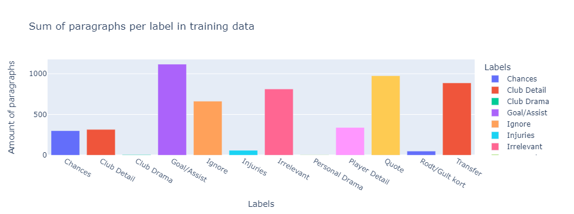

.. code:: ipython3

    multi_label_string = data.copy().dropna()
    multi_label_string['label'] = multi_label_string['label'].apply(', '.join)
    px.bar(multi_label_string.groupby(['label'], as_index=False).agg(count=('label', 'count')),
                 x='label', y='count',
                 color='label',
                 labels={'label': 'Labels', 'count': 'Amount of paragraphs'},
                 title='Sum of paragraphs per label set in multi-label data')

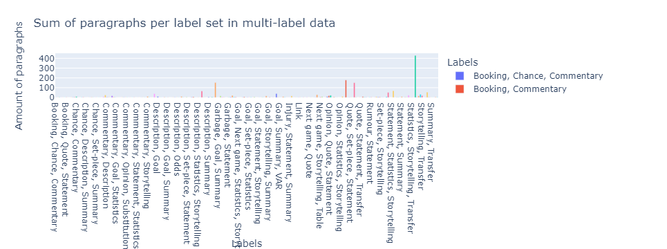

.. code:: ipython3

    px.bar(label_freq.groupby(['label'], as_index=False).agg(sum=('frequency', 'sum')),
                 x='label', y='sum',
                 color='label',
                 labels={'label': 'Labels', 'sum': 'Amount of paragraphs'},
                 title='Sum of paragraphs per label in multi-label data')

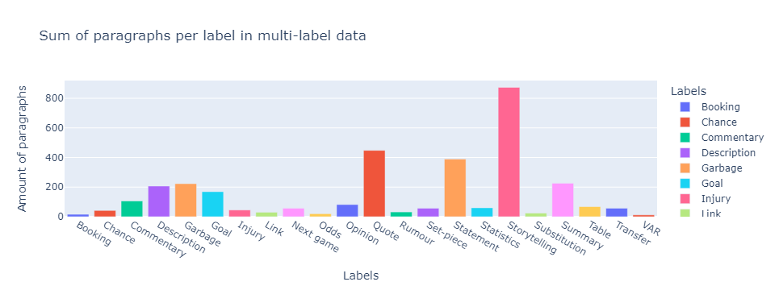

.. code:: ipython3

    px.bar(train.groupby(['label'], as_index=False).agg(sum_words=('num_words', 'sum')),
                 x='label', y='sum_words',
                 color='label',
                 labels={'label': 'Labels', 'sum_words': 'Amount of words'},
                 title='Sum of words per label in training data')

.. code:: ipython3

    exploded_data = data.explode('label').reset_index(drop=True)
    px.bar(exploded_data.groupby(['label'], as_index=False).agg(sum_words=('num_words', 'sum')),
                 x='label', y='sum_words',
                 color='label',
                 labels={'label': 'Labels', 'sum_words': 'Amount of words'},
                 title='Sum of words per label in multi-label data')

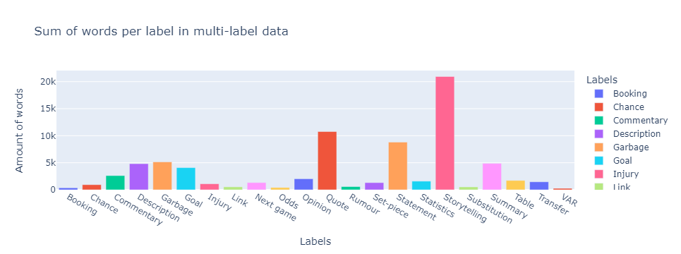

.. code:: ipython3

    px.bar(train.groupby(['label'], as_index=False).agg(sum_char=('num_char', 'sum')),
                 x='label', y='sum_char',
                 color='label',
                 labels={'label': 'Labels', 'sum_char': 'Amount of characters'},
                 title='Sum of characters per label in training data')

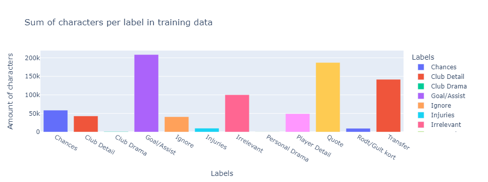

.. code:: ipython3

    exploded_data = data.explode('label').reset_index(drop=True)
    px.bar(exploded_data.groupby(['label'], as_index=False).agg(sum_char=('num_char', 'sum')),
                 x='label', y='sum_char',
                 color='label',
                 labels={'label': 'Labels', 'sum_char': 'Amount of characters'},
                 title='Sum of characters per label in multi-label data')

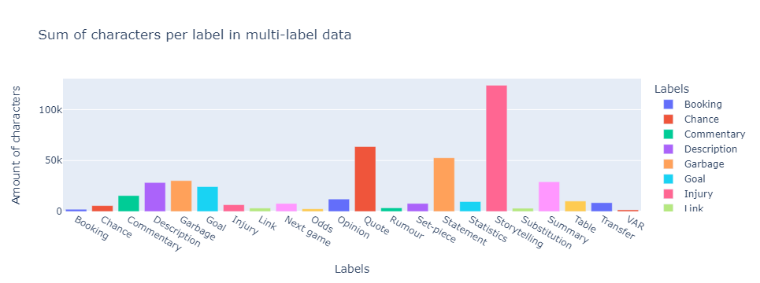

.. code:: ipython3

    px.bar(train.groupby(['label'], as_index=False).agg(sum_sent=('num_sent', 'sum')),
                 x='label', y='sum_sent',
                 color='label',
                 labels={'label': 'Labels', 'sum_sent': 'Amount of characters'},
                 title='Sum of sentences per label in training data')

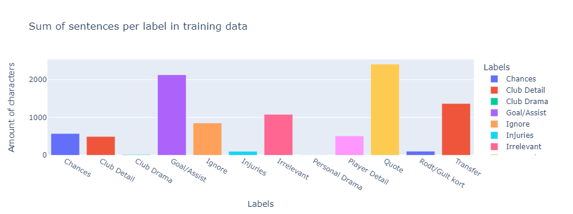

.. code:: ipython3

    exploded_data = data.explode('label').reset_index(drop=True)
    px.bar(exploded_data.groupby(['label'], as_index=False).agg(sum_sent=('num_sent', 'sum')),
                 x='label', y='sum_sent',
                 color='label',
                 labels={'label': 'Labels', 'sum_sent': 'Amount of characters'},
                 title='Sum of sentences per label in multi-label data')

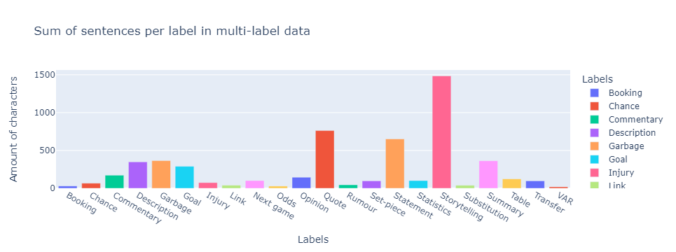

.. code:: ipython3

    plots = train.columns[2:].to_list()
    
    for plot in plots:
        fig = ff.create_distplot([train[plot]], [plot], curve_type='kde')
        fig.update_layout(title = 'Training data - ' + plot.capitalize())
        fig.show()

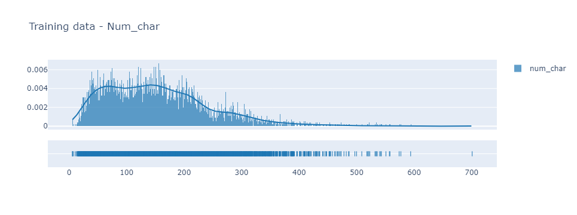
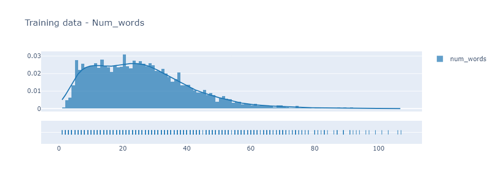
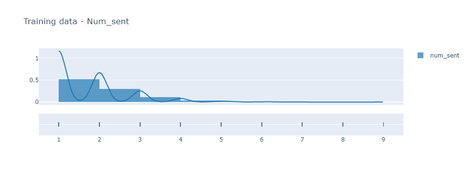
.. image:: eda_v2_images/output_36_3.png
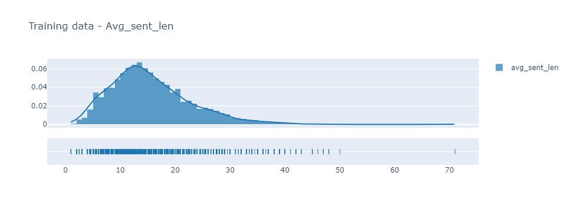

.. code:: ipython3

    plots = data.columns[2:].to_list()
    
    for plot in plots:
        fig = ff.create_distplot([train[plot]], [plot], curve_type='kde')
        fig.update_layout(title = 'Multi-label data - ' + plot.capitalize())
        fig.show()

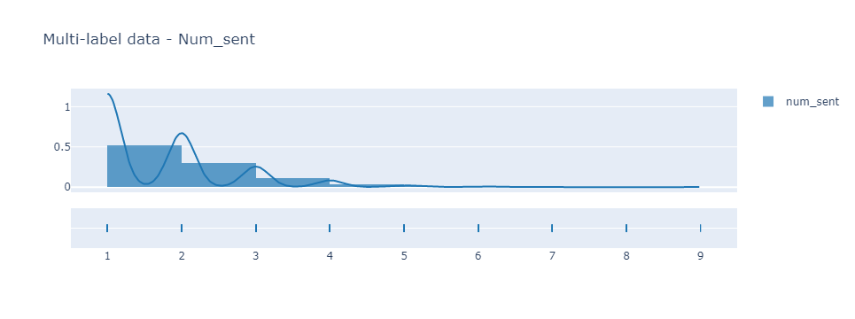
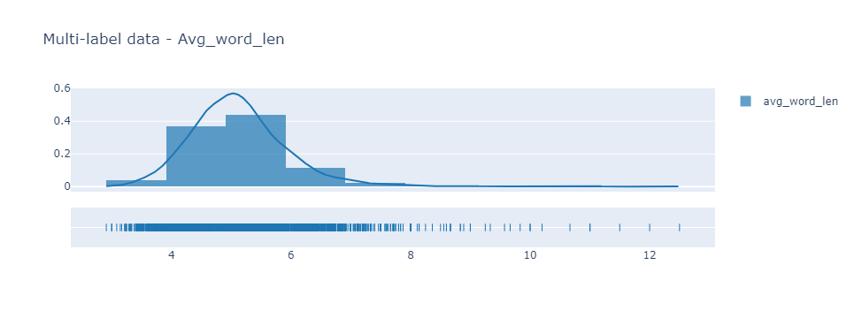

Nordskog data
^^^^^^^^^^^^^

.. code:: ipython3

    processed_train.remove_extra_spaces_from_text()
    processed_train.remove_paragraphs_over_65_words()
    train = processed_train.data.copy()

.. code:: ipython3

    stop = set(stopwords.words('norwegian'))
    corpus = [word for i in train['text'].str.split().values.tolist() for word in i if (word not in stop)]

.. code:: ipython3

    most_frequent = FreqDist(corpus).most_common(10)
    most_frequent

.. parsed-literal::

    [('–', 1173),
     ('Det', 830),
     ('fikk', 496),
     ('ballen', 476),
     ('minutter', 469),
     ('sier', 434),
     ('TV', 423),
     ('Han', 395),
     ('første', 391),
     ('to', 377)]

.. code:: ipython3

    words, frequency = [], []
    for word, count in most_frequent:
        words.append(word)
        frequency.append(count)
        
    fig = px.bar(x=frequency, y=words)
    fig.update_yaxes(autorange="reversed")

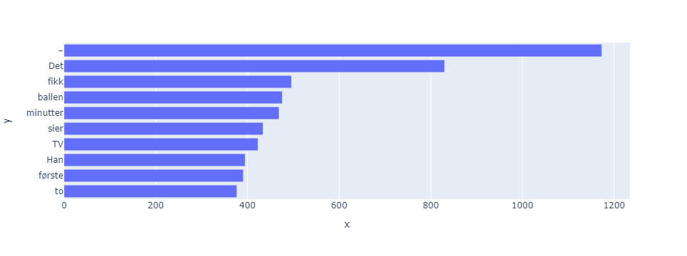

.. code:: ipython3

    vec = CountVectorizer(ngram_range = (2,2))
    bow = vec.fit_transform(train['text'])
    count_values = bow.toarray().sum(axis=0)
    ngram_freq = pd.DataFrame(sorted([(count_values[i], k) for k, i in vec.vocabulary_.items()], reverse = True))
    ngram_freq.columns = ["frequency", "ngram"]
    ngram_freq.head(10)

.. raw:: html

    

    
    <table border="1" class="dataframe">
      <thead>
        <tr style="text-align: right;">
          <th></th>
          <th>frequency</th>
          <th>ngram</th>
        </tr>
      </thead>
      <tbody>
        <tr>
          <th>0</th>
          <td>415</td>
          <td>det er</td>
        </tr>
        <tr>
          <th>1</th>
          <td>267</td>
          <td>det var</td>
        </tr>
        <tr>
          <th>2</th>
          <td>236</td>
          <td>premier league</td>
        </tr>
        <tr>
          <th>3</th>
          <td>204</td>
          <td>at han</td>
        </tr>
        <tr>
          <th>4</th>
          <td>159</td>
          <td>var det</td>
        </tr>
        <tr>
          <th>5</th>
          <td>159</td>
          <td>på tv</td>
        </tr>
        <tr>
          <th>6</th>
          <td>153</td>
          <td>manchester united</td>
        </tr>
        <tr>
          <th>7</th>
          <td>143</td>
          <td>da han</td>
        </tr>
        <tr>
          <th>8</th>
          <td>142</td>
          <td>real madrid</td>
        </tr>
        <tr>
          <th>9</th>
          <td>138</td>
          <td>han har</td>
        </tr>
      </tbody>
    </table>
    

.. code:: ipython3

    vec = CountVectorizer(ngram_range = (3,3))
    bow = vec.fit_transform(train['text'])
    count_values = bow.toarray().sum(axis=0)
    ngram_freq = pd.DataFrame(sorted([(count_values[i], k) for k, i in vec.vocabulary_.items()], reverse = True))
    ngram_freq.columns = ["frequency", "ngram"]
    ngram_freq.head(10)

.. raw:: html

    

    
    <table border="1" class="dataframe">
      <thead>
        <tr style="text-align: right;">
          <th></th>
          <th>frequency</th>
          <th>ngram</th>
        </tr>
      </thead>
      <tbody>
        <tr>
          <th>0</th>
          <td>77</td>
          <td>tv sport premium</td>
        </tr>
        <tr>
          <th>1</th>
          <td>60</td>
          <td>på tv sport</td>
        </tr>
        <tr>
          <th>2</th>
          <td>46</td>
          <td>det er en</td>
        </tr>
        <tr>
          <th>3</th>
          <td>41</td>
          <td>sport premium og</td>
        </tr>
        <tr>
          <th>4</th>
          <td>41</td>
          <td>det er ikke</td>
        </tr>
        <tr>
          <th>5</th>
          <td>37</td>
          <td>minutter før slutt</td>
        </tr>
        <tr>
          <th>6</th>
          <td>36</td>
          <td>men det er</td>
        </tr>
        <tr>
          <th>7</th>
          <td>36</td>
          <td>han er en</td>
        </tr>
        <tr>
          <th>8</th>
          <td>36</td>
          <td>det var en</td>
        </tr>
        <tr>
          <th>9</th>
          <td>35</td>
          <td>før full tid</td>
        </tr>
      </tbody>
    </table>
    

Multi-label data
^^^^^^^^^^^^^^^^

.. code:: ipython3

    stop = set(stopwords.words('norwegian'))
    corpus = [word for i in preprocessed_data['text'].str.split().values.tolist() for word in i if (word not in stop)]
    most_frequent = FreqDist(corpus).most_common(10)
    most_frequent

.. parsed-literal::

    [('–', 999),
     ('vg', 220),
     ('sier', 211),
     ('manchester', 184),
     ('vm', 166),
     ('league', 150),
     ('to', 129),
     ('kampen', 122),
     ('første', 115),
     ('år', 112)]

.. code:: ipython3

    words, frequency = [], []
    for word, count in most_frequent:
        words.append(word)
        frequency.append(count)
        
    fig = px.bar(x=frequency, y=words)
    fig.update_yaxes(autorange="reversed")

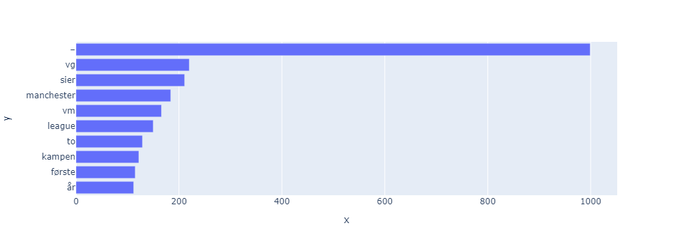

.. code:: ipython3

    vec = CountVectorizer(ngram_range = (2,2))
    bow = vec.fit_transform(preprocessed_data['text'])
    count_values = bow.toarray().sum(axis=0)
    ngram_freq = pd.DataFrame(sorted([(count_values[i], k) for k, i in vec.vocabulary_.items()], reverse = True))
    ngram_freq.columns = ["frequency", "ngram"]
    ngram_freq.head(10)

.. raw:: html

    

    
    <table border="1" class="dataframe">
      <thead>
        <tr style="text-align: right;">
          <th></th>
          <th>frequency</th>
          <th>ngram</th>
        </tr>
      </thead>
      <tbody>
        <tr>
          <th>0</th>
          <td>80</td>
          <td>manchester united</td>
        </tr>
        <tr>
          <th>1</th>
          <td>77</td>
          <td>bodø glimt</td>
        </tr>
        <tr>
          <th>2</th>
          <td>71</td>
          <td>manchester city</td>
        </tr>
        <tr>
          <th>3</th>
          <td>64</td>
          <td>premier league</td>
        </tr>
        <tr>
          <th>4</th>
          <td>55</td>
          <td>erling braut</td>
        </tr>
        <tr>
          <th>5</th>
          <td>53</td>
          <td>braut haaland</td>
        </tr>
        <tr>
          <th>6</th>
          <td>49</td>
          <td>champions league</td>
        </tr>
        <tr>
          <th>7</th>
          <td>35</td>
          <td>real madrid</td>
        </tr>
        <tr>
          <th>8</th>
          <td>24</td>
          <td>første gang</td>
        </tr>
        <tr>
          <th>9</th>
          <td>22</td>
          <td>ullevaal stadion</td>
        </tr>
      </tbody>
    </table>
    

.. code:: ipython3

    vec = CountVectorizer(ngram_range = (3,3))
    bow = vec.fit_transform(preprocessed_data['text'])
    count_values = bow.toarray().sum(axis=0)
    ngram_freq = pd.DataFrame(sorted([(count_values[i], k) for k, i in vec.vocabulary_.items()], reverse = True))
    ngram_freq.columns = ["frequency", "ngram"]
    ngram_freq.head(10)

.. raw:: html

    

    
    <table border="1" class="dataframe">
      <thead>
        <tr style="text-align: right;">
          <th></th>
          <th>frequency</th>
          <th>ngram</th>
        </tr>
      </thead>
      <tbody>
        <tr>
          <th>0</th>
          <td>52</td>
          <td>erling braut haaland</td>
        </tr>
        <tr>
          <th>1</th>
          <td>17</td>
          <td>ullevaal stadion vg</td>
        </tr>
        <tr>
          <th>2</th>
          <td>11</td>
          <td>trener kjetil knutsen</td>
        </tr>
        <tr>
          <th>3</th>
          <td>9</td>
          <td>vg bodø glimt</td>
        </tr>
        <tr>
          <th>4</th>
          <td>9</td>
          <td>glimt trener kjetil</td>
        </tr>
        <tr>
          <th>5</th>
          <td>9</td>
          <td>erik ten hag</td>
        </tr>
        <tr>
          <th>6</th>
          <td>8</td>
          <td>john arne riise</td>
        </tr>
        <tr>
          <th>7</th>
          <td>7</td>
          <td>vg erling braut</td>
        </tr>
        <tr>
          <th>8</th>
          <td>6</td>
          <td>nils arne eggen</td>
        </tr>
        <tr>
          <th>9</th>
          <td>6</td>
          <td>lillestrøm vg lillestrøm</td>
        </tr>
      </tbody>
    </table>
    

